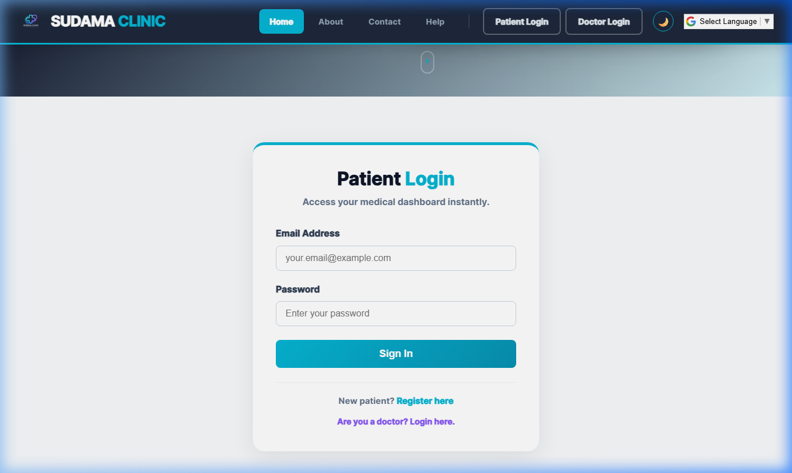
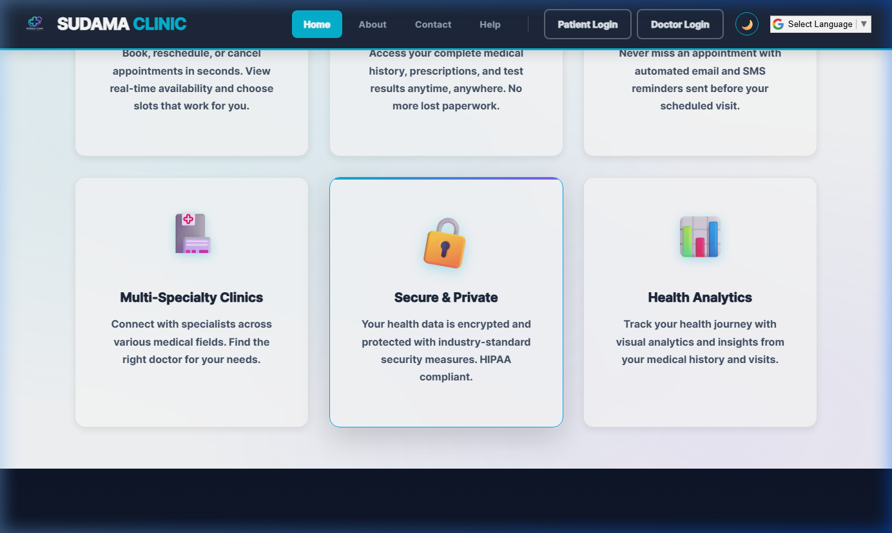
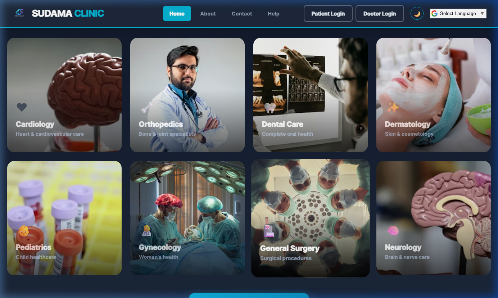
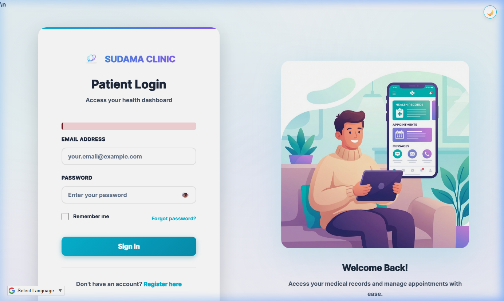

<p align="center">
  
</p>

<h1 align="center">🏥 Smart Clinic — SUDAMA CLINIC</h1>
<h3 align="center">
  <em>A Modern, Full-Stack Healthcare Management System</em>
</h3>

<p align="center">
  
  
  
  
  
  
</p>

<p align="center">
  <a href="#-features">Features</a> •
  <a href="#-screenshots">Screenshots</a> •
  <a href="#-tech-stack">Tech Stack</a> •
  <a href="#-installation">Installation</a> •
  <a href="#-usage">Usage</a> •
  <a href="#-database-schema">Database</a> •
  <a href="#-project-structure">Structure</a> •
  <a href="#-contributing">Contributing</a>
</p>

---

## 📋 Overview

**Smart Clinic (SUDAMA CLINIC)** is a comprehensive, production-ready web application that digitizes end-to-end clinic operations. It provides secure, role-based portal access for **Administrators**, **Doctors**, and **Patients** — enabling seamless appointment booking, schedule management, electronic prescriptions, medical record keeping, and real-time messaging.

Built with a modern dark-themed UI featuring glassmorphism, smooth animations, and responsive design, Smart Clinic delivers a premium healthcare management experience that works beautifully across all devices.

---

## ✨ Features

### 🧑‍💼 Patient Portal
| Feature | Description |
|---------|-------------|
| 📝 **Self-Registration** | Patients can create accounts with personal info, medical history, allergies, and emergency contacts |
| 📅 **Smart Appointment Booking** | 4-step booking wizard: Select Doctor → Choose Date & Time → Enter Details → Payment |
| 📋 **Appointment Management** | View, track, and cancel appointments with real-time status updates (Pending / Confirmed / Completed) |
| 💊 **Electronic Prescriptions** | View detailed prescriptions with medicine names, dosages, frequencies, and doctor instructions |
| 📂 **Medical Records** | Upload and organize lab reports, X-rays, vaccinations with a complete visit history timeline |
| ⚖️ **Compare Doctors** | Side-by-side doctor comparison by specialization, experience, fees, and availability |
| 💬 **Secure Messaging** | Direct messaging system to communicate with doctors |
| ⚙️ **Profile Management** | Update personal info, medical history, allergies, and profile picture |
| 🔔 **Notifications** | Real-time unread message counter and appointment alerts |

### 👨‍⚕️ Doctor Portal
| Feature | Description |
|---------|-------------|
| 📊 **Dashboard Analytics** | Overview of today's appointments, total patients, pending consultations, and completed visits |
| 📅 **Appointment Management** | View, confirm, and manage all patient appointments with status filters |
| 💊 **Digital Prescriptions** | Write prescriptions with diagnosis, multiple medicines (name, dosage, frequency, duration), and follow-up dates |
| 👥 **Patient Directory** | View detailed patient profiles, visit history, and medical records |
| 🕒 **Schedule Management** | Configure available days and time slots for appointment bookings |
| 💬 **Patient Messaging** | Communicate with patients via a built-in messaging system |
| ⚙️ **Profile Settings** | Update professional info, qualifications, and consultation charges |

### 🔑 Admin Panel
| Feature | Description |
|---------|-------------|
| 📊 **System Dashboard** | Real-time stats: Total Doctors, Total Patients, Today's Appointments, Today's Revenue (₹) |
| 👨‍⚕️ **Doctor Management** | Add, edit, activate/deactivate doctors with full profile management and photo upload |
| 👥 **Patient Management** | View and manage all registered patients with search functionality |
| 📅 **Appointment Oversight** | Monitor all appointments across the clinic with filtering capabilities |
| 📈 **Reports & Analytics** | Revenue charts, top doctors by appointments, appointment status distribution, and data export |
| ⚙️ **System Settings** | Configure clinic name, contact info, working hours, and system preferences |

### 🎨 Design & UX
| Feature | Description |
|---------|-------------|
| 🌙 **Dark/Light Theme** | Toggle between dark and light modes with persistent preference |
| 📱 **Fully Responsive** | Optimized for desktop, tablet, and mobile with collapsible sidebar |
| ✨ **Modern Animations** | Smooth transitions, floating elements, gradient effects, and micro-interactions |
| 🔐 **Role-Based Access** | Secure authentication with session management and unauthorized access protection |
| 🎯 **Multi-Specialty Support** | 15+ medical specializations (Cardiology, Orthopedics, Dental, Pediatrics, Neurology, etc.) |

---

## 📸 Screenshots

### 🏠 Landing Page & Hero Section
<p align="center">
  
</p>
<p align="center"><em>Modern dark-themed landing page with gradient hero section, animated tagline, and patient login card</em></p>

---

### 🔐 Patient Login & Registration
<p align="center">
  
</p>
<p align="center"><em>Clean patient login form with intuitive UI and quick access to registration</em></p>

---

### ✨ Features Overview
<p align="center">
  
</p>
<p align="center"><em>Key platform features — Easy Appointment Booking, Digital Medical Records, Smart Reminders, Multi-Specialty Support, Security & Privacy, and Health Analytics</em></p>

---

### 🏥 Multi-Specialty Clinic Divisions
<p align="center">
  
</p>
<p align="center"><em>8+ medical specializations including Cardiology, Orthopedics, Dental Care, Dermatology, Pediatrics, Gynecology, Surgery, and Neurology</em></p>

---

### 🔐 Authentication Portal
<p align="center">
  
</p>
<p align="center"><em>Beautiful split-layout patient login page with modern healthcare illustration and responsive design</em></p>

---

## 🛠️ Tech Stack

| Layer | Technology | Purpose |
|-------|-----------|---------|
| **Frontend** | HTML5, CSS3, ES6 JavaScript | Structure, styling, and interactivity |
| **Backend** | PHP 8.x | Server-side logic and API handling |
| **Database** | MySQL / MariaDB | Relational data storage |
| **Server** | Apache (via XAMPP) | Local development server |
| **Auth** | PHP Sessions + bcrypt | Secure authentication & password hashing |
| **Design** | Custom CSS (Glassmorphism) | Modern dark-themed UI with gradients |

### Key Design Patterns
- **MVC-inspired Structure** — Separate includes for config, database, functions, and sidebar components
- **PDO Prepared Statements** — Protection against SQL injection attacks
- **Role-Based Access Control (RBAC)** — Separate portals with session-based authorization
- **Responsive Grid Layouts** — CSS Grid & Flexbox for adaptive layouts
- **Progressive Enhancement** — JavaScript-enhanced forms with PHP fallbacks

---

## 🚀 Installation

### Prerequisites
- [XAMPP](https://www.apachefriends.org/) (or any LAMP/WAMP stack) with:
  - **PHP 7.4+** (PHP 8.x recommended)
  - **MySQL 5.7+** / MariaDB
  - **Apache** web server

### Step-by-Step Setup

```bash
# 1. Clone the repository
git clone https://github.com/Deep-tech-1314/Smart-Clinic-Management-System.git

# 2. Move the project to your server's web root
# For XAMPP: C:\xampp\htdocs\
# For WAMP: C:\wamp64\www\
cp -r Smart-Clinic-Management-System "C:\xampp\htdocs\Smart Clinic"
```

```sql
-- 3. Create the database
-- Open phpMyAdmin (http://localhost/phpmyadmin)
-- Import the SQL file: database/smart_clinic.sql
-- This will automatically:
--   ✅ Create the 'smart_clinic' database
--   ✅ Create all required tables
--   ✅ Insert default specializations (15+)
--   ✅ Create sample admin, doctor, and patient accounts
--   ✅ Add sample appointments and prescriptions
```

```bash
# 4. Start Apache and MySQL from XAMPP Control Panel

# 5. Open your browser and navigate to:
# http://localhost/Smart Clinic/index.php
```

### ⚙️ Configuration

Update database credentials in `includes/database.php` if needed:

```php
$host = 'localhost';
$dbname = 'smart_clinic';
$username = 'root';
$password = '';  // Default XAMPP password is empty
```

---

## 🔐 Usage

### Default Login Credentials

> ⚠️ **Security Warning:** Change these credentials immediately in a production environment!

| Role | Email | Password | Portal URL |
|------|-------|----------|------------|
| 🔑 **Admin** | `admin@smartclinic.com` | `Admin@123` | `/admin-login.php` |
| 👨‍⚕️ **Doctor** | `rajesh.kumar@smartclinic.com` | `Doctor@123` | `/doctor-login.php` |
| 👨‍⚕️ **Doctor** | `priya.sharma@smartclinic.com` | `Doctor@123` | `/doctor-login.php` |
| 🧑‍💼 **Patient** | `john.doe@email.com` | `Patient@123` | `/patient-login.php` |
| 🧑‍💼 **Patient** | `jane.smith@email.com` | `Patient@123` | `/patient-login.php` |

### Quick Start Guide

```
1️⃣  Visit the landing page → Click "Book Appointment"
2️⃣  Register as a new patient (or use sample credentials above)
3️⃣  Browse doctors by specialization → Select a doctor
4️⃣  Choose a date and available time slot
5️⃣  Enter reason for visit and symptoms
6️⃣  Complete payment → Appointment confirmed! ✅
```

---

## 🗄️ Database Schema

The application uses a relational MySQL database with **9 tables** and **2 views**:

```
┌──────────────────┐     ┌──────────────────┐     ┌──────────────────┐
│      users       │     │    patients       │     │     doctors      │
│──────────────────│     │──────────────────│     │──────────────────│
│ id (PK)          │────▶│ user_id (FK)     │     │ user_id (FK)     │◀──┐
│ email            │     │ first_name       │     │ name             │   │
│ password (bcrypt)│     │ last_name        │     │ specialization_id│──▶│specializations│
│ role (ENUM)      │     │ phone, dob       │     │ qualification    │   │               │
│ status           │     │ blood_group      │     │ experience_years │   │ id (PK)       │
│ last_login       │     │ medical_history  │     │ consultation_fee │   │ name, icon    │
└──────────────────┘     │ allergies        │     │ available_days   │   └───────────────┘
                         └──────────────────┘     └──────────────────┘
                                  │                        │
                                  ▼                        ▼
                         ┌──────────────────┐     ┌──────────────────┐
                         │  appointments    │     │   time_slots     │
                         │──────────────────│     │──────────────────│
                         │ patient_id (FK)  │     │ doctor_id (FK)   │
                         │ doctor_id (FK)   │     │ day_of_week      │
                         │ date, time       │     │ start_time       │
                         │ type, status     │     │ end_time         │
                         │ charge, payment  │     │ max_patients     │
                         └──────────────────┘     └──────────────────┘
                                  │
                    ┌─────────────┼─────────────┐
                    ▼             ▼              ▼
           ┌───────────────┐ ┌──────────┐ ┌────────────────┐
           │ prescriptions │ │ messages │ │ medical_records│
           │───────────────│ │──────────│ │────────────────│
           │ diagnosis     │ │ sender   │ │ record_type    │
           │ medicines(JSON)│ │ receiver│ │ title, file    │
           │ instructions  │ │ message  │ │ record_date    │
           │ follow_up_date│ │ is_read  │ │                │
           └───────────────┘ └──────────┘ └────────────────┘
```

### Additional Tables
- **`staff`** — Admin/staff profiles linked to users
- **`specializations`** — 15 pre-loaded medical specialties

### Database Views
- **`v_appointments`** — Joined view of appointments with patient/doctor details
- **`v_doctors`** — Joined view of doctors with specialization and user info

---

## 📁 Project Structure

```
Smart Clinic/
│
├── 📄 index.php                    # Landing page with hero section & specialties
├── 📄 about.php                    # About the clinic page
├── 📄 contact.php                  # Contact form and clinic information
├── 📄 help.php                     # Help center & FAQ
│
├── 🔐 Authentication
│   ├── patient-login.php           # Patient login portal
│   ├── patient-register.php        # New patient registration
│   ├── doctor-login.php            # Doctor login portal
│   ├── admin-login.php             # Admin login portal
│   ├── logout.php                  # Session termination
│   └── unauthorized.php            # Access denied page
│
├── 🧑‍💼 Patient Portal
│   ├── patient-dashboard.php       # Patient overview & quick actions
│   ├── book-appointment.php        # 4-step appointment booking wizard
│   ├── my-appointments.php         # View & manage appointments
│   ├── appointment-history.php     # Past appointment history
│   ├── view-prescription.php       # View prescriptions
│   ├── medical-records.php         # Upload & view medical records
│   ├── patient-doctors.php         # Browse available doctors
│   ├── compare-doctors.php         # Side-by-side doctor comparison
│   ├── patient-messages.php        # Messaging with doctors
│   ├── patient-details.php         # View personal details
│   └── patient-settings.php        # Profile & settings management
│
├── 👨‍⚕️ Doctor Portal
│   ├── doctor-dashboard.php        # Doctor overview & today's schedule
│   ├── doctor-appointments.php     # Manage all appointments
│   ├── doctor-patients.php         # View patient directory
│   ├── doctor-patient-details.php  # Detailed patient profile view
│   ├── prescription.php            # Write digital prescriptions
│   ├── doctor-schedule.php         # Configure availability & time slots
│   ├── doctor-messages.php         # Messaging with patients
│   └── doctor-settings.php         # Profile settings
│
├── 🔑 Admin Panel
│   ├── admin-dashboard.php         # System-wide analytics
│   ├── manage-doctors.php          # Doctor CRUD management
│   ├── add-doctor.php              # Add new doctor with photo upload
│   ├── admin-doctors.php           # Doctor directory
│   ├── admin-patients.php          # Patient directory
│   ├── admin-appointments.php      # All appointment oversight
│   ├── admin-reports.php           # Revenue & analytics reports
│   └── admin-settings.php          # System configuration
│
├── 📂 includes/
│   ├── config.php                  # App constants & session config
│   ├── database.php                # PDO database connection
│   ├── functions.php               # Helper functions (auth, sanitize, redirect)
│   ├── patient_sidebar.php         # Patient navigation sidebar
│   ├── doctor_sidebar.php          # Doctor navigation sidebar
│   └── admin_sidebar.php           # Admin navigation sidebar
│
├── 🎨 css/
│   ├── styles.css                  # Global styles & design tokens
│   ├── landing.css                 # Landing page specific styles
│   ├── dashboard.css               # Dashboard layout styles
│   ├── components.css              # Reusable UI components
│   ├── auth.css                    # Authentication page styles
│   └── booking.css                 # Booking flow styles
│
├── ⚡ js/
│   ├── main.js                     # Core JavaScript utilities
│   ├── clinic.js                   # Clinic data management
│   ├── booking.js                  # Booking flow logic
│   ├── appointments.js             # Appointment management
│   └── patient-portal.js           # Patient-specific interactions
│
├── 🖼️ images/                      # Static assets (logo, illustrations)
├── 📸 screenshots/                 # README screenshots
├── 📤 uploads/                     # User-uploaded files (profiles, records)
├── 🗄️ database/
│   └── smart_clinic.sql            # Complete database schema & sample data
│
└── 📖 README.md                    # You are here!
```

---

## 🌐 Pages & Routes

| Page | Access | Description |
|------|--------|-------------|
| `/index.php` | 🌍 Public | Landing page with hero, features, specialties |
| `/about.php` | 🌍 Public | About the clinic |
| `/contact.php` | 🌍 Public | Contact form with map |
| `/help.php` | 🌍 Public | FAQ and help center |
| `/patient-login.php` | 🌍 Public | Patient authentication |
| `/patient-register.php` | 🌍 Public | New patient signup |
| `/doctor-login.php` | 🌍 Public | Doctor authentication |
| `/admin-login.php` | 🌍 Public | Admin authentication |
| `/patient-dashboard.php` | 🔒 Patient | Personal health dashboard |
| `/book-appointment.php` | 🔒 Patient | Multi-step booking wizard |
| `/doctor-dashboard.php` | 🔒 Doctor | Today's schedule & stats |
| `/prescription.php` | 🔒 Doctor | Write digital prescription |
| `/admin-dashboard.php` | 🔒 Admin | System-wide analytics |
| `/admin-reports.php` | 🔒 Admin | Revenue & performance reports |

---

## 🔮 Future Enhancements

- [ ] Email/SMS notification integration
- [ ] Online payment gateway (Razorpay/Stripe)
- [ ] Video consultation support
- [ ] Multi-language support
- [ ] PWA (Progressive Web App) support
- [ ] REST API layer
